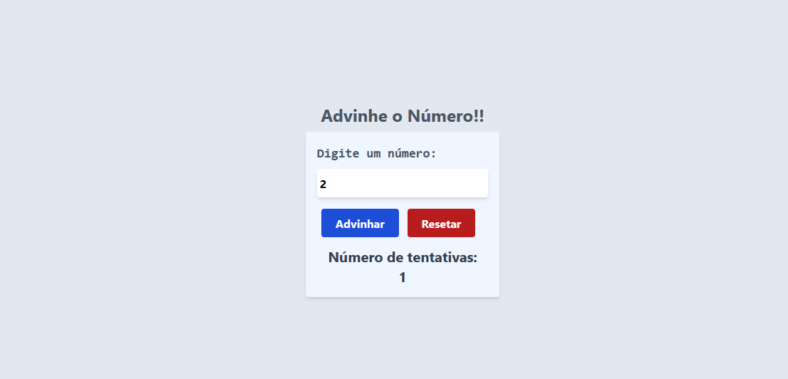

# Random Number Game
O jogo de número aleatório é um projeto desenvolvido com o objetivo de desafiar o usuário a adivinhar um número secreto gerado pelo sistema. O jogo é uma aplicação interativa que combina elementos de lógica e UI, proporcionando uma experiência de aprendizado prática para iniciantes em desenvolvimento web, especialmente na manipulação de DOM, lógica de programação e criação de interações dinâmicas com JavaScript e TypeScript..

This project was bootstrapped with [Create React App](https://github.com/facebook/create-react-app).

## 🔥 Introdução
* O sistema gera um número aleatório entre 0 e 100 no início do jogo. Esse número é o alvo que o jogador deve adivinhar.

* O jogo valida se o número inserido pelo jogador é um valor numérico e se está dentro do intervalo permitido (0 a 100). Caso contrário, exibe uma mensagem de erro.

* O jogo possui um modal que é exibido após cada tentativa, indicando se o próximo número deve ser maior ou menor, baseado na tentativa anterior.

### 🔨 Guia de instalação
Instalação:

    1.Clone o repositório.

    2.Execute npm install para instalar as dependências.

Passo a Passo para Rodar:

    Execute npm start para iniciar o servidor de desenvolvimento.
    
    Acesse http://localhost:3000 no navegador para utilizar a aplicação.

## 📦 Tecnologias usadas:
 
 

## 👷 Autores

* **Ingrid Souza** - *Front-End* - [GitHub](https://github.com/IngridsSilveira)